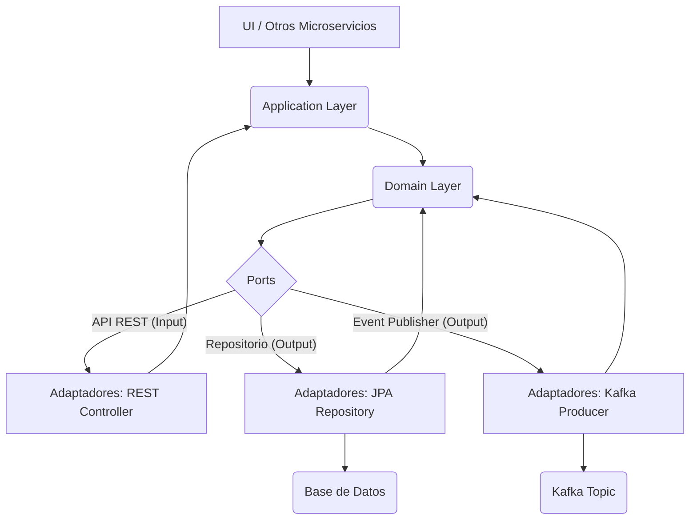

# Target Architecture (To-Be)

## Propuesta de Microservicios

Basándonos en los contextos delimitados identificados en el monolito de Spring PetClinic, proponemos la siguiente división en 3 microservicios:

1.  **Customer Service (Backend Java 21)**: Gestiona la información de `Owners` y `Pets`.
2.  **Vet Service (Backend Java 21)**: Gestiona la información de `Vets` y `Specialties`.
3.  **Appointment Service (Backend Java 21)**: Gestiona las `Visits` y coordina con `Customer Service` para información de `Pet` y con `Vet Service` para información de `Vet`.
4.  **PetClinic Frontend (Angular)**: Nueva aplicación frontend que consume las APIs de los microservicios.

## Arquitectura por Microservicio (Hexagonal + DDD)

Cada microservicio backend seguirá los principios de la Arquitectura Hexagonal y Domain-Driven Design (DDD).



**Capas:**

*   **Application Layer:** Orquesta la lógica de negocio, gestiona transacciones y traduce entre el dominio y los adaptadores.
*   **Domain Layer:** Contiene la lógica de negocio central (Aggregates, Entities, Value Objects, Domain Services, Repositories Interfaces). Es el corazón de la aplicación y es independiente de la tecnología.
*   **Ports:** Interfaces que definen cómo el dominio interactúa con el mundo exterior (ej., `OwnerRepository`, `PetServicePort`).
*   **Adapters:** Implementaciones concretas de los `Ports` que se comunican con tecnologías externas (ej., `JpaOwnerRepository`, `OwnerRestController`, `KafkaEventPublisher`).

## Contratos: APIs REST (OpenAPI) y Eventos

*   **APIs REST:** Cada microservicio expondrá APIs REST bien definidas, siguiendo el estándar OpenAPI (anteriormente Swagger). Esto permitirá una fácil integración con el frontend y otros servicios.
*   **Eventos:** La comunicación asíncrona entre servicios se realizará mediante eventos, utilizando un backbone de eventos como Kafka. Los eventos se definirán con esquemas claros (ej., Avro, JSON Schema) y versiones.

## Propuesta Tecnológica "Moderna pero Estable"

### Backend (Java 21)

*   **Framework:** Spring Boot 3.x (última versión estable).
*   **Lenguaje:** Java 21 LTS.
*   **Persistencia:** Spring Data JPA con Hibernate.
*   **Base de Datos:** PostgreSQL para cada microservicio (bases de datos separadas).
*   **Migraciones de Esquema:** Liquibase o Flyway.
*   **Tolerancia a Fallos:** Resilience4j (Circuit Breaker, Rate Limiter, Retry).
*   **Observabilidad:**
    *   **Métricas:** Micrometer con Prometheus y Grafana.
    *   **Trazas Distribuidas:** OpenTelemetry con Jaeger/Zipkin.
    *   **Logs:** Logback con logs estructurados (JSON) y centralización con ELK Stack (Elasticsearch, Logstash, Kibana) o Grafana Loki.
*   **Testing:** JUnit 5, Mockito, Testcontainers para pruebas de integración.
*   **Build Tool:** Gradle (preferido) o Maven.

### Frontend (Angular)

*   **Framework:** Angular (última versión LTS estable, actualmente Angular 17+).
*   **Arquitectura:** Standalone Components para modularidad. Se podría considerar Nx para gestionar un monorepo si el frontend crece y se divide en micro-frontends.
*   **Tooling:** Angular CLI, ESLint, Prettier.
*   **State Management:** NgRx para aplicaciones complejas o simple servicio RxJS para estados más pequeños.
*   **Styling:** Tailwind CSS o SCSS modular.
*   **Testing:** Karma/Jasmine para unitarias, Cypress para E2E.

### Seguridad

*   **Autenticación/Autorización:** OAuth2/OIDC con un Identity Provider (IdP) como Keycloak o Auth0.
*   **Tokens:** JWT (JSON Web Tokens) para comunicación entre servicios y con el frontend.
*   **API Gateway:** Spring Cloud Gateway (o similar) para centralizar la seguridad, enrutamiento y rate limiting.

### Gestión de Configuración y Secretos

*   **Configuración:** Spring Cloud Config Server o Kubernetes ConfigMaps.
*   **Secretos:** Kubernetes Secrets o HashiCorp Vault para secretos sensibles.

## Diagrama de Arquitectura de Alto Nivel (Contexto)

```mermaid
graph TD
    user("Usuario Final") --> frontend("PetClinic Frontend");
    frontend --> customer_service("Customer Service");
    frontend --> vet_service("Vet Service");
    frontend --> appointment_service("Appointment Service");

    subgraph Microservicios PetClinic
        customer_service["Customer Service"] --> database_customer("Base de Datos Customer");
        vet_service["Vet Service"] --> database_vet("Base de Datos Vet");
        appointment_service["Appointment Service"] --> database_appointment("Base de Datos Appointment");

        customer_service --> event_bus("Event Bus");
        vet_service --> event_bus;
        appointment_service --> event_bus;

        frontend --> identity_provider("Identity Provider");
        customer_service --> identity_provider;
        vet_service --> identity_provider;
        appointment_service --> identity_provider;

        customer_service --> observability("Plataforma de Observabilidad");
        vet_service --> observability;
        appointment_service --> observability;
    end

    identity_provider("Identity Provider")
    event_bus("Event Bus")
    database_customer("Base de Datos Customer")
    database_vet("Base de Datos Vet")
    database_appointment("Base de Datos Appointment")
    observability("Plataforma de Observabilidad")

    user --> frontend "Usa"
    frontend --> customer_service "Consume API REST"
    frontend --> vet_service "Consume API REST"
    frontend --> appointment_service "Consume API REST"

    customer_service --> database_customer "Lee/Escribe"
    vet_service --> database_vet "Lee/Escribe"
    appointment_service --> database_appointment "Lee/Escribe"

    customer_service --> event_bus "Publica/Consume eventos"
    vet_service --> event_bus "Publica/Consume eventos"
    appointment_service --> event_bus "Publica/Consume eventos"

    frontend --> identity_provider "Autenticación"
    subgraph microservices_boundary [Microservicios PetClinic]
    microservices_boundary -- "Validación de Tokens" --> identity_provider
    end

    subgraph microservices_observability_boundary [Microservicios PetClinic]
    microservices_observability_boundary -- "Envía métricas, logs, trazas" --> observability
    end


```